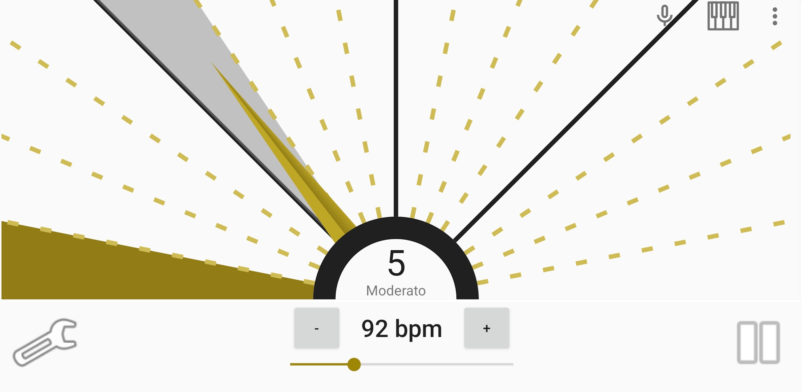

# Diatronome
*Diatronome* is a 3-in-1 android application. It provide a **tuner**, a **visual-metronome**, and a **synthesizer**.
The application is provided as is, in hope it will be useful.
It is delivered without any unnecessary features like advertisement, selling personal data, privacy spy, making money behind you, etc.
*Diatronome* is a contraction of the word *diapason*, meaning *fork-tuner* in french and *metronome*.

# Features
## Tuner
* Note reference pitch from 430 Hz to 450 Hz. (Tap to bottom-right corner to adjust calibration).
* Transposition support. (Tap to bottom-left corner to set transposition).
* Multiple temperament table.
* Several pitch-detection algorithm available.
* Adjustable microphone sensitivity.

## Visual metronome
* Tempo from 1 to 320 beats per minute.
* Visual indicator for better timing precision.
* Set *accent*, *normal*, *sub-division* or *off* beat by taping on a pie part.
* Adjustable table signature, including irregular measure.
* Tap on center to adjust tempo.
* Tap on tempo to open a keyboard for manual input.
* Change metronome's tonality in settings.

## Synthesizer
* 8 octaves range.
* Continuous playback mode.
* Different waveforms available.

## Other application feature
* Customization of themes colors.
* Option to keep the screen on.
* Metronome can play in the background.
* Changing sharp / flat and note name mode.
* Dark and light themes available.

# Required permissions
* Audio record (for tuner function).
* Media playback (for metronome and note playing).

# Known issues
* The tuner use a custom algorithm based on envelop detector. The accuracy may vary depending on your device brand or your instrument. In some cases, alternative methods like Fourier spectral analysis or Yin detection might be more suitable.
* Minor glitches may occurs when using note player, due to abrupt wave stops causing signal distortion.
* AudioTrack may not works properly on Android virtual device.

## Developers
Your contributions are welcome! Whether for improvements or translations, or simply create a ticket your help would be appreciated.
However, remember: the app should remain simple to use and to develop. It must also be compatible with a wide range of devices, including my 10-year-old tablet !

# Support it
If you enjoy this application, you could consider **making a donation**.

Paypal: [paypal](https://www.paypal.com/donate/?hosted_button_id=SJJNG9XBY59W4)
Libreapay: [libreapay](https://en.liberapay.com/grizzlyfute)

